# 🚀 Locket Gold Activator Bot (Professional Edition)

<div align="center">

[](https://python.org)
[](https://core.telegram.org/bots)
[](https://docs.python.org/3/library/asyncio.html)
[](LICENSE)
[]()

[](https://vercel.com/new/clone?repository-url=https://github.com/trongthaohub/Locket-Gold-main&env=BOT_TOKEN,NEXTDNS_KEY,WEB_APP_URL&project-name=Locket-Gold-main&repository-name=Locket-Gold-main)

**The most advanced, high-performance Telegram Bot for automating Locket Gold activation.**  
*Built with speed, security, and scalability in mind.*

[Why Choose This Bot?](#-why-choose-locket-gold-activator-bot) • [Features](#-key-features) • [Installation](#-installation) • [Deployment](#-deployment) • [Configuration](#-configuration)

</div>

---

## 💎 Why Choose Locket Gold Activator Bot?

Unlike other basic scripts or tools, this bot is engineered as a **production-grade system**. It solves the common problems of slowness, API bans, and revocations.

| Feature | This Bot 🚀 | Standard Scripts ❌ |
| :--- | :--- | :--- |
| **Performance** | **Zero-Lag Async Core**. Handles thousands of users without freezing. | Single-threaded. Freezes while processing one user. |
| **Reliability** | **Round-Robin Token Rotation**. Distributes load to prevent bans. | Uses 1 token until it dies or gets rate-limited. |
| **Safety** | **Smart Anti-Revoke**. Auto-generates NextDNS profiles to block validation servers. | No protection. Gold disappears after a few hours/days. |
| **User Experience** | **Real-time Queue Updates**. Users know their exact position (`#1`, `#2`...). | Silent failure. Users don't know if it's working. |
| **Architecture** | **Worker Pool**. Scalable system (add 1 or 100 workers easily). | Simple loop. Cannot scale with demand. |

---

## 🌟 Key Features

### ⚡ **High-Performance Core**
*   **Fully Asynchronous**: Powered by `aiohttp` and `asyncio` for non-blocking I/O. The bot remains responsive to commands even under heavy load.
*   **Worker Pool System**: Configurable number of concurrent workers (`NUM_WORKERS`) to parallelize request processing.

### 🛡️ **Advanced Security**
*   **NextDNS Integration**: Automatically creates a unique DNS profile for each user that blocks `revenuecat.com`, ensuring the Gold subscription sticks.
*   **Strict Cooldowns**: Enforces a 45-second cooldown per token usage to mimic human behavior and avoid detection.

### 🤖 **Smart Automation**
*   **Auto-Resolution**: Just paste a Locket username or link; the bot handles UID resolution automatically.
*   **Queue Management**: FIFO (First-In-First-Out) queue system with live status updates to prevent API flooding.
### 📱 **Telegram Mini App (New!)**
*   **Modern Interface**: Premium glassmorphism UI for a superior mobile experience.
*   **Real-time Interaction**: Watch the exploit progress in a terminal-style view right inside Telegram.
*   **One-Click DNS**: Seamless setup for iOS and Android directly from the app.
*   **Global Stats**: Monitor active users and total requests globally.

---

## 🛠️ Installation

### Prerequisites
*   Python 3.9+
*   Telegram Bot Token via [@BotFather](https://t.me/BotFather)
*   NextDNS API Key via [NextDNS Developer](https://my.nextdns.io/account)

### Automated Setup
We provide a **one-click setup script** that handles virtual environments and dependencies.

```bash
# 1. Clone the repository
git clone https://github.com/thanhdo1110/Locket-Gold.git
cd Locket-Gold

# 2. Run the setup script
chmod +x run.sh
./run.sh
```

---

## 🚀 Deployment

### Deploy to Vercel (Recommended)
1. Push this source code to your GitHub repository.
2. Click the **Deploy to Vercel** button above or click [here](https://vercel.com/new/clone?repository-url=https://github.com/YOUR_GITHUB_USERNAME/YOUR_REPO_NAME&env=BOT_TOKEN,NEXTDNS_KEY,WEB_APP_URL).
3. Fill in the Environment Variables:
   * `BOT_TOKEN`: Your Telegram Bot Token.
   * `NEXTDNS_KEY`: Your NextDNS API Key.
   * `WEB_APP_URL`: Your Vercel deployment URL (e.g., `https://locket-gold.vercel.app`).
4. Once deployed, set your Webhook:
   `https://api.telegram.org/bot<BOT_TOKEN>/setWebhook?url=https://<YOUR_APP>.vercel.app/api/webhook`

---

The system is configured via `app/config.py`. You must provide your API keys and Receipt Tokens here.

```python
# app/config.py

# 1. System Credantials
BOT_TOKEN   = "YOUR_TELEGRAM_BOT_TOKEN_HERE"
NEXTDNS_KEY = "YOUR_NEXTDNS_API_KEY_HERE"
ADMIN_ID    = 123456789  # Replace with your Telegram User ID

# 2. Worker Settings
# Match this number to the number of Token Sets you have to ensure 1-to-1 mapping.
NUM_WORKERS = 2 

# 3. Receipt Tokens (Dumped from Jailbroken/Rooted/Nonjb Devices)
TOKEN_SETS = [
    {
        "fetch_token": "ey...",      # RevenueCat Fetch Token
        "app_transaction": "ey...",  # Apple Receipt Transaction
        "is_sandbox": False          # Must be False for Production
    },
    # Add more token sets as needed...
]
```

---

## 🎮 Commands

### User Commands
Use these commands in your Telegram bot:

| Command | Usage | Description |
| :--- | :--- | :--- |
| `/start` | - | Initialize the bot and show the main menu. |
| `/setlang` | - | Switch between English 🇺🇸 and Vietnamese 🇻🇳. |
| `/help` | - | View detailed help and instructions. |
| **Direct Message** | `username` | Send any Locket username or link to queue an upgrade. |

### Admin Commands (👑)
Restricted to the `ADMIN_ID` configured in `config.py`.

| Command | Usage | Description |
| :--- | :--- | :--- |
| `/stats` | - | View **Queue Size**, Active Workers, and System Health. |
| `/noti` | `/noti <msg>` | Broadcast a message to **all** bot users. |
| `/rs` | `/rs <id>` | Reset the daily limit for a specific user ID. |
| `/setdonate` | Reply to photo | Set the custom "Success" image shown after activation. |

---

## 📊 System Architecture

```mermaid
graph TD
    User([👤 User]) -->|Sends Username| Bot
    
    subgraph "🤖 Bot Core (AsyncIO)"
        Bot[Telegram Handler] -->|Enqueue| Queue[FIFO Queue]
        Queue -->|1. Pop Request| Worker[👱 Worker Thread]
    end
    
    subgraph "☁️ External APIs"
        Worker -->|2. Inject Token| RC[RevenueCat API]
        Worker -->|3. Create Profile| NextDNS[NextDNS API]
    end
    
    RC -- 200 OK --> Worker
    NextDNS -- Profile Link --> Worker
    
    Worker -->|4. Success Message| Bot
    Bot -->|5. Notify User| User
```



---

## ⚠️ Disclaimer

> **This project is for EDUCATIONAL and RESEARCH purposes only.**  
> The author is not responsible for any misuse of this software. By using this tool, you agree to take full responsibility for your actions. "Locket Widget" and "RevenueCat" are trademarks of their respective owners.

---

<div align="center">

**[ Report Bug ](https://github.com/thanhdo1110/Locket-Gold/issues) • [ Request Feature ](https://github.com/thanhdo1110/Locket-Gold/issues)**

Made with ❤️ by [Thanh Do](https://github.com/thanhdo1110)

</div>
